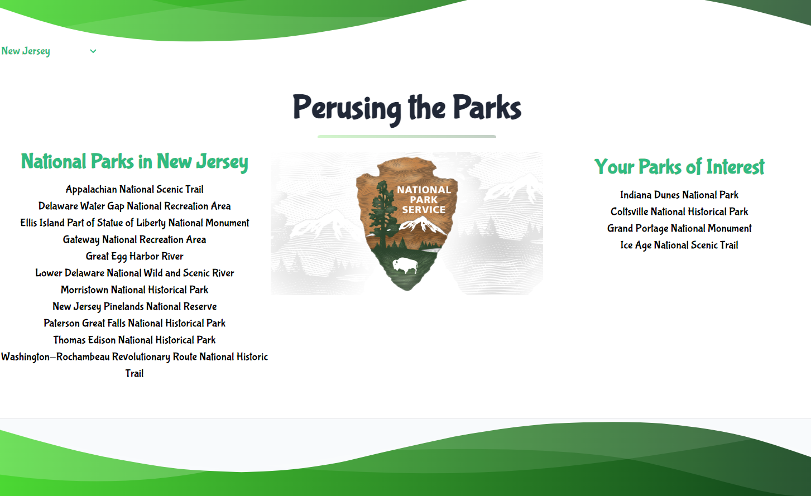
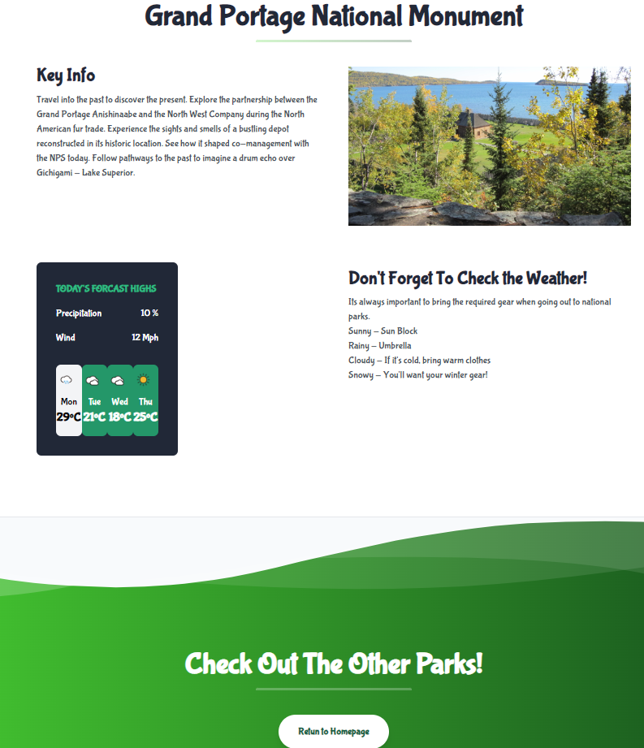

# Perusing the Parks

## Description

This application allows people to view different National Parks. 
Also getting key information and weather info related to the selected park.

## Table of Contents 

Homepage to select which state and park and see which parks have been recently viewed.
Parkpage to display key information about park, along with weather information.

## Usage

Visit our deployed application.
Select your state of interest to produce list of National Parks in that state.
Select your park of interest to be brought to the park page with key information, a picture from that park, and weather details.
Click the button at the bottom to return to the homepage and check out other parks!

## Credits

Created by:
Chanse Shirley, Lauren Haas, Tuji Abdulaya, and Bryton Russell

